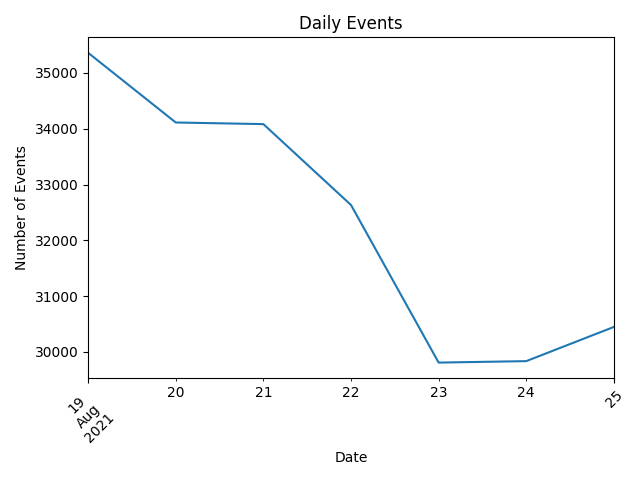
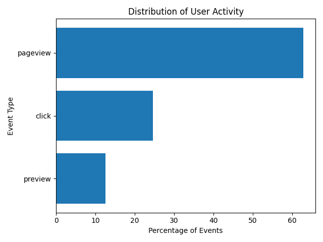
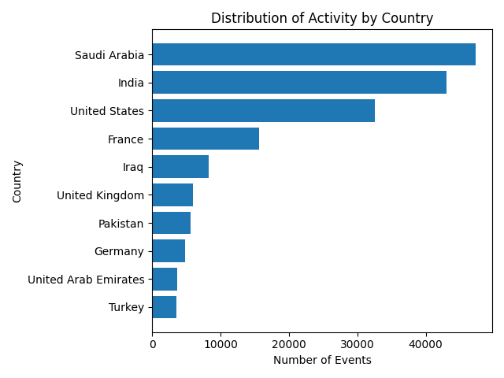

# 🎧 Music Streaming Data Analysis

## 📌 Project Overview
This project analyzes user interaction data from a music streaming platform to understand user behavior, engagement patterns, and content preferences.

The dataset contains event-level data (pageviews, clicks, previews) collected over one week.

---

## 🎯 Objectives
- Analyze user activity over time  
- Measure engagement (CTR, preview rate)  
- Identify most popular tracks and artists  
- Explore geographic distribution of users  
- Compare content preferences across countries  

---

## 📊 Key Insights

### 📈 User Activity Over Time


User activity shows a gradual decline over the observed week, followed by stabilization.

---

### 🔁 Event Distribution


- Pageviews: **62.76%**
- Clicks: **24.63%**
- Previews: **12.61%**

User behavior is dominated by browsing activity, with a strong conversion into clicks.

---

### 🌍 Geographic Distribution


- Top 3 countries:
  - Saudi Arabia
  - India
  - United States  
- These account for **54.31% of total activity**

User activity is highly concentrated geographically.

---

### 🎵 Content Popularity
- *“Jalebi Baby” by Tesher* accounts for **17.39% of all clicks**

This indicates strong global popularity of specific tracks.

---

### 🌐 Cross-Country Preferences
- Top track appears in **73 countries** (all data)
- After filtering (≥100 clicks): **31 countries**

> This shows that part of the apparent global dominance is driven by low-activity countries, but the track remains highly popular even in major markets.

---

## ⚙️ Tools Used
- Python (Pandas, NumPy)
- Matplotlib
- Jupyter Notebook

---

## 📁 Project Structure
```
music-streaming-data-analysis/
│
├── notebook/
│ └── analysis.ipynb
│
├── images/
│ ├── activity_over_time.png
│ ├── country_activity.png
│ └── event_distribution.png
│
├── data/
│ └── (dataset not included)
│
└── README.md
```
---

## 📎 Dataset
Dataset available on Kaggle:  
https://www.kaggle.com/datasets/bhanupratapbiswas/website-traffic-analysis

---

## 🚀 About This Project
This project was created as part of a data analysis learning journey and demonstrates skills in:

- Data cleaning and transformation  
- Exploratory data analysis  
- Data visualization  
- Business-oriented insights  

---
## 👩‍💻 Author
Elena Ozola
